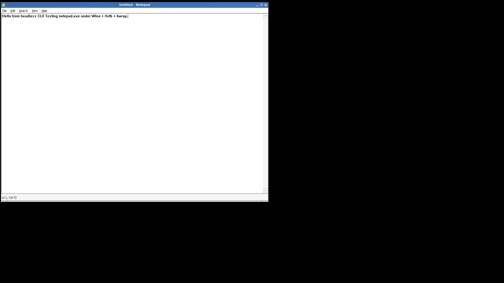

# HeadlessLab

> Run Windows GUI applications headlessly on Linux — no sudo, no Docker, no physical GPU. Designed for LLM agents, CI pipelines, and automated testing.

HeadlessLab provides a unified Python CLI (`headless`) that lets AI agents and automation scripts execute, observe, and interact with Windows applications (DirectX 9, console, GUI) in headless mode under Linux. Every command returns a single JSON object to stdout, making it trivially parseable by LLMs and scripts.

**Validated on Debian 13 (trixie).** Supports both 64-bit (PE32+ x86-64) and 32-bit (PE32 i386) Windows binaries via Wine WoW64.

[](LICENSE)
[](https://www.debian.org/)
[](https://www.winehq.org/)



*Windows `notepad.exe` running headless under Wine + Xvfb + Mesa llvmpipe, with text typed via `headless type "Hello from headless CLI!"`.*

---

## Quick Start (Recommended: Download AppImage — no compilation needed)

The fastest way to get started. Download the pre-built AppImage from GitHub Releases — it contains everything (Wine 10, Mesa llvmpipe, bwrap, the `headless` CLI, and example EXEs) in a single file. **No compilation, no `apt-get download`, no `dpkg-deb -x` required.**

### Step 1 — Install host tools (one-time, ~10MB)

HeadlessLab needs a few X11 tools on the host (Xvfb, Openbox, xdotool, etc.). The repo bundles them as `.deb` packages so you can install without sudo:

```bash
git clone https://github.com/Vmarcelo49/HeadlessLab.git
cd HeadlessLab
bash bin/install-host-deps.sh
source ~/.local/share/headlesslab/env.sh
```

> **Only Xvfb requires sudo** (it needs kernel DRM access): `sudo apt-get install -y xvfb`

### Step 2 — Download the AppImage

```bash
# Download the latest release (~253MB)
curl -sSL -o HeadlessLab.AppImage \
  https://github.com/Vmarcelo49/HeadlessLab/releases/latest/download/HeadlessLab.AppImage
chmod +x HeadlessLab.AppImage
```

### Step 3 — Run
Check your environment for FUSE

In environments with FUSE (most desktops):

```bash
./HeadlessLab.AppImage --verify
# Expected: [OK] Smoke Test PASS! The runtime is working perfectly (62543 colors > 100)!
```

In environments **without FUSE** (Docker containers, LLM sandboxes, CI):

```bash
# Pre-extract once (creates squashfs-root/ directory, ~870MB)
./HeadlessLab.AppImage --appimage-extract
cd squashfs-root
export APPDIR="$PWD"

# Run commands from the extracted directory
./AppRun --verify
./AppRun init
./AppRun exec /path/to/app.exe
```
delete the AppImage to save space.

### Step 4 — Run your own Windows app

```bash
# From the extracted AppImage directory (or use ./HeadlessLab.AppImage instead of ./AppRun):
./AppRun init
# {"status": "ok", "display": ":99", "geometry": "1920x1080x24"}

./AppRun exec /path/to/your-app.exe
# {"status": "ok", "session_id": "sess_123", "pid": 987, "arch": "x86_64"}

./AppRun wait-window sess_123
# {"status": "ok", "elapsed_ms": 480}

./AppRun screenshot --session sess_123 --out /tmp/capture.png
# {"status": "ok", "path": "/tmp/capture.png"}

./AppRun kill sess_123
# {"status": "ok", "killed_pids": [987, 988, 989, ...]}
```

---

## Alternative: Build from Source

If you can't use the AppImage (e.g., different architecture, need to modify the code, or want the smallest possible footprint), you can build the Wine prefix from scratch. This downloads ~150MB of `.deb` packages and takes ~5 minutes.

```bash
git clone https://github.com/Vmarcelo49/HeadlessLab.git
cd HeadlessLab

# 1. Install host tools (same as Step 1 above)
bash bin/install-host-deps.sh
source ~/.local/share/headlesslab/env.sh

# 2. Build the Wine prefix from scratch (~5 min)
bash bin/build-from-scratch.sh

# 3. (Optional) Add 32-bit (i386) support
bash bin/setup-32bit.sh

# 4. Verify
./bin/headless --verify
```

---

## CLI Reference

Run `headless --help` for the full reference with examples. Here's a summary:

| Command | What it does |
|---------|-------------|
| `headless --verify` | Smoke test — verifies the entire stack works |
| `headless init` | Start virtual display (Xvfb + Openbox) |
| `headless exec <exe_path>` | Execute a Windows .exe, returns `session_id` + `arch` |
| `headless wait-window <sess_id>` | Wait for window to appear and pixels to stabilize |
| `headless screenshot --session <sess_id> --out <path>` | Capture a PNG screenshot |
| `headless click <x> <y> --session <sess_id>` | Mouse left-click |
| `headless key <keysym> --session <sess_id>` | Press a key (Return, Escape, ctrl+v, ...) |
| `headless type "<text>" --session <sess_id>` | Type ASCII text |
| `headless clipboard --write "<text>" --session <sess_id>` | Write to clipboard (Unicode OK) |
| `headless accept-dialog <sess_id>` | Press Enter on modal dialogs (EULA, OK/Cancel) |
| `headless windows --session <sess_id>` | List windows, detect modals |
| `headless logs <sess_id>` | Get Wine + EXE stdout/stderr (auto UTF-16 decode) |
| `headless list` | List all sessions |
| `headless kill <sess_id>` | Kill session and free resources |

**Every command returns a single JSON object to stdout.** Warnings go to stderr. Session cache lives at `~/.cache/headlesslab/`.

---

## Why HeadlessLab?

Traditional approaches to running Windows apps headless on Linux have painful tradeoffs:

| Approach | Problem |
|----------|---------|
| Docker + Wine | Requires Docker daemon (root), heavy images (~2GB), no GPU passthrough in CI |
| VNC + Real GPU | Needs a physical GPU or expensive cloud GPU instance |
| `xvfb-run wine app.exe` | No window management, no input simulation, no screenshot stability detection |
| Proton/Steam | Tied to Steam, ~50GB runtime, not scriptable for arbitrary EXEs |

**HeadlessLab** solves this by bundling Wine 10 + Mesa llvmpipe (software rendering) + Bubblewrap (no-root sandbox) + Xvfb + Openbox into a single CLI that returns JSON. It runs entirely in userspace — no sudo anywhere (except Xvfb, which needs kernel access).

---

## 32-bit (i386) Windows Binary Support

HeadlessLab supports both 64-bit (PE32+ x86-64) and 32-bit (PE32 i386) Windows binaries via Wine's WoW64 mode. The 32-bit support is **opt-in** — if you only need 64-bit, skip this.

**AppImage users:** The AppImage already includes 32-bit support. Skip this section.

**Build-from-source users:**

```bash
bash bin/setup-32bit.sh
```

This downloads `wine32:i386`, `libwine:i386`, and `libc6:i386` from the Debian pool (no sudo, no `dpkg --add-architecture`), patches the 32-bit wine binary's ELF interpreter, and populates `syswow64/` with i386 DLLs. The `headless` CLI auto-detects PE architecture and reports it:

```bash
headless exec hello_win_32.exe
# {"status": "ok", "session_id": "sess_...", "pid": 12345, "arch": "i386"}

headless exec hello_win.exe
# {"status": "ok", "session_id": "sess_...", "pid": 12346, "arch": "x86_64"}
```

---

## Repository Structure

```
HeadlessLab/
├── bin/
│   ├── headless               # Unified Python CLI (primary entrypoint)
│   ├── setup.sh               # Host setup (verifies host + downloads AppImage if needed)
│   ├── install-host-deps.sh   # Installs bundled .deb packages into ~/.local/ (no sudo)
│   ├── setup-32bit.sh         # Adds 32-bit (i386) support (build-from-source only)
│   ├── build-from-scratch.sh  # Rebuilds the Wine prefix from scratch (~5 min)
│   ├── pack-appimage.sh       # Packages prefix + CLI into a standalone AppImage
│   └── ...                    # Other helper scripts
├── host-debs/                 # Bundled .deb packages (~10MB amd64 + ~94MB i386)
│   ├── MANIFEST.md            # License + source info for each package
│   ├── *.deb                  # 42 amd64 packages (openbox, xdotool, ImageMagick, ...)
│   └── i386/                  # 3 i386 packages (wine32, libwine, libc6) for 32-bit
├── examples/                  # Sample Windows .exe files for testing
│   ├── dx9_triangle.*         # Minimal DX9 triangle (smoke test)
│   ├── dx9_cube.*             # Rotating textured cube (vertex + index buffer + transforms)
│   ├── hello_win.*            # Console program that prints system info (64-bit + 32-bit)
│   └── example_screenshot.png # Reference screenshot
├── docs/
│   └── GUIDE_LLM.md           # In-depth operational guide for LLM agents
├── README.md
├── GITHUB.md                  # How to publish releases
└── LICENSE                    # MIT
```

---

## Architecture

```
┌────────────────────────────────────────────────────────────────────┐
│ Linux user space (no sudo, no Docker)                              │
│                                                                    │
│  app.exe (PE32/PE32+)  ←─── you want to run this                  │
│       │                                                            │
│       ▼                                                            │
│  ┌──────────────────────────────────────────────────────────┐     │
│  │ Wine 10.0 (wine64 / wine via WoW64)                      │     │
│  │   • Loads PE .dlls from system32/ (64-bit) or syswow64/  │     │
│  │   • d3d9.dll → wined3d.dll → OpenGL                      │     │
│  │   • winex11.drv → X11 protocol                          │     │
│  └──────────────────────────────────────────────────────────┘     │
│       │ (Bubblewrap sandbox for path remapping)                    │
│       ▼                                                            │
│  ┌──────────────────────────────────────────────────────────┐     │
│  │ Bubblewrap container (user namespaces, no root)          │     │
│  │   • --bind rootfs/usr /usr  (symlinks to host)           │     │
│  │   • --ro-bind prefix/...wine /usr/lib/wine               │     │
│  │   • --proc /proc  (CRITICAL: wine needs /proc/self)      │     │
│  └──────────────────────────────────────────────────────────┘     │
│       │                                                            │
│       ▼                                                            │
│  ┌──────────────────────────────────────────────────────────┐     │
│  │ Xvfb :99  (virtual display 1920x1080x24, -ac no auth)    │     │
│  └──────────────────────────────────────────────────────────┘     │
│       │                                                            │
│       ▼                                                            │
│  ┌──────────────────────────────────────────────────────────┐     │
│  │ Mesa llvmpipe (software rasterizer, CPU-only)            │     │
│  │   • OpenGL via libGL + LLVM JIT                          │     │
│  │   • Vulkan via libvulkan_lvp.so                          │     │
│  └──────────────────────────────────────────────────────────┘     │
│                                                                    │
│  Screenshot: 'import' (ImageMagick) or python-xlib + Pillow        │
└────────────────────────────────────────────────────────────────────┘
```

---

## Known Limitations

1. **Performance**: ~5-10 fps on llvmpipe software rendering. Suitable for screenshots and functional validation, not real-time gaming.
2. **No audio**: Wine ALSA configuration is omitted (silent operation).
3. **No DX10/DX11/DX12**: Limited to DX9. Higher versions require DXVK and a physical Vulkan-capable GPU.
4. **Xvfb requires sudo**: Xvfb is the one host dependency that cannot be bundled (needs kernel DRM access).
5. **EXE write paths**: Windows apps can only write to paths inside the Wine prefix (`C:\users\...`). Writing to `Z:\home\...` is not supported by the bwrap sandbox.
6. **AppImage size**: The AppImage is ~253MB (contains Wine 10 + Mesa + LLVM). This is the tradeoff for zero compilation.

---

## Documentation

- **[`docs/GUIDE_LLM.md`](docs/GUIDE_LLM.md)** — In-depth operational guide for LLM agents (architecture, debugging, common problems)
- **[`GITHUB.md`](GITHUB.md)** — How to publish releases and AppImages to GitHub
- **`headless --help`** — Full CLI reference with examples
- **[`host-debs/MANIFEST.md`](host-debs/MANIFEST.md)** — License and source info for bundled .deb packages

---

## Contributing

Contributions are welcome! Please:

1. Fork the repository
2. Create a feature branch (`git checkout -b feature/amazing-feature`)
3. Commit your changes (`git commit -m 'Add amazing feature'`)
4. Push to the branch (`git push origin feature/amazing-feature`)
5. Open a Pull Request

Before submitting, ensure `./bin/headless --verify` passes.

---

## License

MIT — see [LICENSE](LICENSE).

This bundle includes binary distributions of Wine 10.0 (LGPL-2.1), Mesa Vulkan drivers (MIT), Bubblewrap (LGPL-2.0+), zlib 1.3.1 (zlib license), and LLVM 19 (Apache-2.0). Source code for these components is available at their respective upstream repositories.
